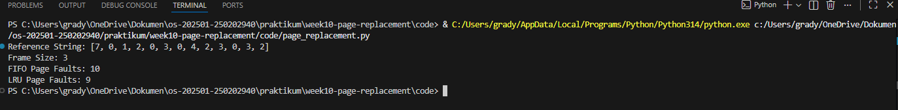

# Laporan Praktikum Minggu 10
Topik: Manajemen Memori – Page Replacement (FIFO & LRU)

---

## Identitas
- **Nama**  : Gradyan Alannahda Shofari
- **NIM**   : 250202940 
- **Kelas** : 1IKRB

---

## Tujuan
1. Mengimplementasikan algoritma page replacement FIFO dalam program.
2. Mengimplementasikan algoritma page replacement LRU dalam program.
3. Menjalankan simulasi page replacement dengan dataset tertentu.
4. Membandingkan performa FIFO dan LRU berdasarkan jumlah *page fault*.
5. Menyajikan hasil simulasi dalam laporan yang sistematis.

---

## Dasar Teori
- Memori virtual memungkinkan program lebih besar dari RAM berjalan dengan membagi data ke dalam halaman (page).
- Page fault terjadi saat halaman yang dibutuhkan tidak ada di memori, sehingga perlu page replacement.
- FIFO mengganti halaman berdasarkan urutan masuk, sederhana tapi bisa menimbulkan Belady’s Anomaly.
- LRU mengganti halaman yang paling lama tidak digunakan, lebih kompleks namun biasanya lebih efisien.

---

## Langkah Praktikum
1. **Menyiapkan Dataset**

   Gunakan *reference string* berikut sebagai contoh:
   ```
   7, 0, 1, 2, 0, 3, 0, 4, 2, 3, 0, 3, 2
   ```
   Jumlah frame memori: **3 frame**.

2. **Implementasi FIFO**

   - Simulasikan penggantian halaman menggunakan algoritma FIFO.
   - Catat setiap *page hit* dan *page fault*.
   - Hitung total *page fault*.

3. **Implementasi LRU**

   - Simulasikan penggantian halaman menggunakan algoritma LRU.
   - Catat setiap *page hit* dan *page fault*.
   - Hitung total *page fault*.

4. **Eksekusi & Validasi**

   - Jalankan program untuk FIFO dan LRU.
   - Pastikan hasil simulasi logis dan konsisten.
   - Simpan screenshot hasil eksekusi.

5. **Analisis Perbandingan**

   Buat tabel perbandingan seperti berikut:

   | Algoritma | Jumlah Page Fault | Keterangan |
   |:--|:--:|:--|
   | FIFO | ... | ... |
   | LRU | ... | ... |


   - Jelaskan mengapa jumlah *page fault* bisa berbeda.
   - Analisis algoritma mana yang lebih efisien dan alasannya.

6. **Commit & Push**

   ```bash
   git add .
   git commit -m "Minggu 10 - Page Replacement FIFO & LRU"
   git push origin main
   ```
---

## Kode / Perintah
Tuliskan potongan kode atau perintah utama:
```bash
def fifo(reference_string, frame_size):
    frames = []
    page_faults = 0
    queue_index = 0
    for page in reference_string:
        if page not in frames:
            if len(frames) < frame_size:
                frames.append(page)
            else:
                frames[queue_index] = page
                queue_index = (queue_index + 1) % frame_size
            page_faults += 1
    return page_faults

def lru(reference_string, frame_size):
    frames = []
    page_faults = 0
    recent_use = {}
    for i, page in enumerate(reference_string):
        if page not in frames:
            if len(frames) < frame_size:
                frames.append(page)
            else:
                lru_page = min(frames, key=lambda p: recent_use.get(p, -1))
                frames[frames.index(lru_page)] = page
            page_faults += 1
        recent_use[page] = i
    return page_faults

# Contoh eksekusi
reference_string = [7,0,1,2,0,3,0,4,2,3,0,3,2]
frame_size = 3

print("FIFO Page Faults:", fifo(reference_string, frame_size))
print("LRU Page Faults :", lru(reference_string, frame_size))
```

---

## Hasil Eksekusi



---

## Analisis Perbandingan
| Algoritma | Jumlah Page Fault | Keterangan |
   |:--|:--:|:--|
   | FIFO | 10 | Mengganti halaman berdasarkan urutan masuk, tanpa mempertimbangkan frekuensi penggunaan |
   | LRU | 9 | Mengganti halaman yang paling lama tidak digunakan, lebih efisien dalam pola akses nyata
 |

- Jelaskan mengapa jumlah *page fault* bisa berbeda.

Jumlah page fault bisa berbeda karena setiap algoritma memiliki cara yang berbeda dalam memilih halaman mana yang akan diganti saat memori penuh:
1. FIFO mengganti halaman yang paling awal masuk, tanpa mempertimbangkan apakah halaman itu masih sering digunakan.
2. LRU mengganti halaman yang paling lama tidak digunakan, sehingga lebih adaptif terhadap pola akses memori.

Akibatnya, LRU cenderung menghasilkan page fault yang lebih sedikit dibanding FIFO, terutama pada pola akses yang berulang atau lokalitas tinggi.

- Analisis algoritma mana yang lebih efisien dan alasannya.

LRU lebih efisien daripada FIFO karena LRU mengganti halaman yang paling lama tidak dipakai, sehingga halaman yang masih relevan tetap ada di memori. Sementara FIFO hanya melihat urutan masuk, sehingga bisa mengganti halaman yang masih sering digunakan dan menambah page fault.

---

## Kesimpulan
- Algoritma LRU lebih efisien dibanding FIFO, karena mempertahankan halaman yang baru saja digunakan sehingga jumlah page fault lebih sedikit.
- FIFO lebih sederhana namun kurang adaptif, sehingga bisa mengganti halaman yang masih relevan dan berpotensi menimbulkan Belady’s Anomaly.
- Perbandingan hasil simulasi menunjukkan perbedaan jumlah page fault, yang menegaskan pentingnya pemilihan algoritma page replacement sesuai pola akses memori nyata.


---

## Quiz
1. Apa perbedaan utama FIFO dan LRU?
Perbedaan utama antara FIFO dan LRU terletak pada cara mereka memilih halaman yang akan diganti saat terjadi page fault: FIFO mengganti halaman yang paling lama masuk, sedangkan LRU mengganti halaman yang paling lama tidak digunakan.

2. Mengapa FIFO dapat menghasilkan *Belady’s Anomaly*?
FIFO bisa menghasilkan Belady’s Anomaly karena ia hanya mengganti halaman berdasarkan urutan masuk, tanpa melihat apakah halaman itu masih sering dipakai. Akibatnya, menambah jumlah frame tidak selalu mengurangi page fault—bahkan bisa meningkat karena halaman penting ikut terganti.

3. Mengapa LRU umumnya menghasilkan performa lebih baik dibanding FIFO?

LRU lebih baik dibanding FIFO karena ia mempertahankan halaman yang baru saja digunakan, sehingga lebih sesuai dengan pola akses memori nyata.

- FIFO: hanya melihat urutan masuk, bisa mengganti halaman yang masih sering dipakai.
- LRU: mengganti halaman yang paling lama tidak digunakan, sehingga halaman yang relevan tetap ada di memori.


---

## Refleksi Diri
Tuliskan secara singkat:
- Apa bagian yang paling menantang minggu ini?  
- Bagaimana cara Anda mengatasinya?  

---

**Credit:**  
_Template laporan praktikum Sistem Operasi (SO-202501) – Universitas Putra Bangsa_
