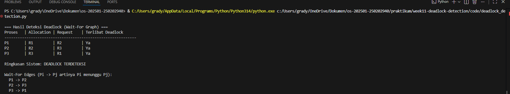

# Laporan Praktikum Minggu 11
Topik: Simulasi dan Deteksi Deadlock

---

## Identitas
- **Nama**  : Gradyan Alannahda Shofari
- **NIM**   : 250202940  
- **Kelas** : 1IKRB

---

## Tujuan
- Membuat program sederhana untuk mendeteksi deadlock.
- Menjalankan simulasi deteksi deadlock dengan dataset uji.
- Menyajikan hasil analisis deadlock dalam bentuk tabel.
- Memberikan interpretasi hasil uji secara logis dan sistematis.
- Menyusun laporan praktikum sesuai format yang ditentukan.

---

## Dasar Teori
- Deadlock adalah kondisi di mana sekumpulan proses saling menunggu resource yang tidak dapat dilepas, sehingga tidak ada proses yang bisa melanjutkan eksekusi.
- Empat kondisi perlu deadlock: mutual exclusion, hold and wait, no preemption, dan circular wait. Deadlock hanya terjadi jika keempat kondisi ini terpenuhi.
- Wait-For Graph (WFG) digunakan untuk memodelkan hubungan antar proses. Node mewakili proses, dan edge Pi → Pj berarti Pi menunggu resource yang sedang dipegang Pj.
- Deteksi deadlock dilakukan dengan mencari siklus pada WFG. Jika ada siklus, proses dalam siklus tersebut dianggap terlibat deadlock.
- Perbedaan dengan prevention/avoidance: deteksi tidak mencegah deadlock sejak awal, tetapi mengidentifikasi deadlock yang sudah terjadi agar sistem bisa melakukan recovery.


---

## Langkah Praktikum
1. **Menyiapkan Dataset**

   Gunakan dataset sederhana yang berisi:
   - Daftar proses  
   - Resource Allocation  
   - Resource Request / Need

   Contoh tabel:

   | Proses | Allocation | Request |
   |:--:|:--:|:--:|
   | P1 | R1 | R2 |
   | P2 | R2 | R3 |
   | P3 | R3 | R1 |

2. **Implementasi Algoritma Deteksi Deadlock**

   Program minimal harus:
   - Membaca data proses dan resource.  
   - Menentukan apakah sistem berada dalam kondisi deadlock.  
   - Menampilkan proses mana saja yang terlibat deadlock.

3. **Eksekusi & Validasi**

   - Jalankan program dengan dataset uji.  
   - Validasi hasil deteksi dengan analisis manual/logis.  
   - Simpan hasil eksekusi dalam bentuk screenshot.

4. **Analisis Hasil**

   - Sajikan hasil deteksi dalam tabel (proses deadlock / tidak).  
   - Jelaskan mengapa deadlock terjadi atau tidak terjadi.  
   - Kaitkan hasil dengan teori deadlock (empat kondisi).

5. **Commit & Push**
```bash
   git add .
   git commit -m "Minggu 11 - Deadlock Detection"
   git push origin main
   ```
---

## Kode / Perintah
1. Membaca dataset CSV
   ```bash
   def read_dataset(csv_path):
    processes = []
    allocations = {}  # resource -> process yang memegangnya
    requests = {}     # process -> resource yang diminta

    with open(csv_path, newline='', encoding='utf-8') as f:
        reader = csv.DictReader(f)
        for row in reader:
            p = row['Process'].strip()
            a = row['Allocation'].strip() if row.get('Allocation') else ''
            r = row['Request'].strip() if row.get('Request') else ''
            processes.append(p)
            if a:
                allocations[a] = p
            requests[p] = r if r else None
    return processes, allocations, requests

   ```

2. Membentuk Wait-For Graph
   ```bash
def build_wait_for_graph(processes, allocations, requests):
    graph = {p: [] for p in processes}
    for p in processes:
        req_res = requests.get(p)
        if req_res:
            holder = allocations.get(req_res)
            if holder and holder != p:
                graph[p].append(holder)
    return graph

   ```

3. Deteksi siklus (deadlock)
```bash
def detect_cycles(graph):
    color = {u: 0 for u in graph}
    parent = {u: None for u in graph}
    cycles_nodes = set()

    def dfs(u):
        color[u] = 1
        for v in graph[u]:
            if color[v] == 0:
                parent[v] = u
                if dfs(v):
                    return True
            elif color[v] == 1:
                cycles_nodes.add(v)
                w = u
                cycles_nodes.add(w)
                while parent[w] is not None and parent[w] != v:
                    w = parent[w]
                    cycles_nodes.add(w)
                return True
        color[u] = 2
        return False

    has_cycle = False
    for u in graph:
        if color[u] == 0 and dfs(u):
            has_cycle = True
    return has_cycle, cycles_nodes

```
4. Menampilkan hasil
```bash
def print_table(processes, allocations, requests, graph, has_cycle, cycles_nodes):
    print("\n=== Hasil Deteksi Deadlock ===")
    print(f"{'Proses':<8} | {'Allocation':<10} | {'Request':<10} | {'Deadlock':<10}")
    print("-" * 50)
    for p in processes:
        a = next((res for res, holder in allocations.items() if holder == p), "-")
        r = requests.get(p) or "-"
        involved = "Ya" if p in cycles_nodes else "Tidak"
        print(f"{p:<8} | {a:<10} | {r:<10} | {involved:<10}")

    verdict = "DEADLOCK TERDETEKSI" if has_cycle else "TIDAK ADA DEADLOCK"
    print("\nRingkasan Sistem:", verdict)

```

---

## Hasil Eksekusi



---

## Analisis Hasil

1. Jelaskan mengapa deadlock terjadi atau tidak terjadi.

Deadlock terjadi bila semua empat kondisi perlu terpenuhi:
- Mutual exclusion – resource hanya bisa dipakai satu proses.
- Hold and wait – proses memegang satu resource sambil menunggu yang lain.
- No preemption – resource tidak bisa dipaksa diambil.
- Circular wait – ada siklus tunggu antar proses.

Pada dataset P1–P2–P3, terbentuk siklus (P1 → P2 → P3 → P1), sehingga deadlock terjadi.

Jika salah satu kondisi tidak ada (misalnya P3 tidak meminta resource), siklus hilang dan deadlock tidak terjadi.

2. Kaitkan hasil dengan teori deadlock (empat kondisi).
- Mutual exclusion – setiap resource hanya bisa dipegang satu proses.
- Hold and wait – proses menahan resource sambil menunggu resource lain.
- No preemption – resource tidak bisa dipaksa dilepas.
- Circular wait – ada siklus tunggu antar proses (P1 → P2 → P3 → P1).

Karena semua kondisi ada, sistem deadlock. Jika salah satu kondisi tidak terpenuhi (misalnya tidak ada siklus tunggu), maka deadlock tidak terjadi.

---

## Kesimpulan
- Deadlock dapat terdeteksi melalui Wait-For Graph dengan mencari adanya siklus tunggu antar proses; jika siklus ada, maka proses dalam siklus tersebut terjebak deadlock.
- Empat kondisi perlu deadlock (mutual exclusion, hold and wait, no preemption, circular wait) menjadi dasar analisis; hasil simulasi menunjukkan deadlock terjadi karena semua kondisi terpenuhi.
- Deteksi deadlock penting sebagai mekanisme pengamanan sistem operasi, karena tidak semua kasus bisa dicegah atau dihindari, sehingga sistem tetap perlu mampu mengenali dan menangani deadlock yang muncul.


---

## Quiz
1. Apa perbedaan antara *deadlock prevention*, *avoidance*, dan *detection*? 
- Prevention: mencegah deadlock dengan menghapus salah satu syarat (misalnya larang hold and wait).
- Avoidance: mengizinkan permintaan resource, tapi hanya jika sistem tetap dalam safe state.
- Detection: membiarkan deadlock mungkin terjadi, lalu memeriksa adanya siklus dan melakukan recovery.

2. Mengapa deteksi deadlock tetap diperlukan dalam sistem operasi?  

   Deteksi deadlock tetap diperlukan karena:
- Tidak semua sistem bisa mencegah atau menghindari deadlock – strategi prevention dan avoidance sering membatasi fleksibilitas atau menurunkan kinerja.
- Beban kerja dinamis – permintaan resource yang kompleks dan berubah-ubah bisa membuat sistem sulit selalu berada dalam safe state.
- Jaring pengaman – dengan deteksi, sistem dapat mengenali deadlock yang lolos dari pencegahan/avoidance dan melakukan recovery (misalnya menghentikan proses atau melepaskan resource).

3. Apa kelebihan dan kekurangan pendekatan deteksi deadlock?

   Kelebihan deteksi deadlock:
- Fleksibel, tidak membatasi permintaan resource.
- Cocok untuk beban kerja dinamis, bisa recovery setelah terdeteksi.

   Kekurangan deteksi deadlock:
- Ada overhead pemeriksaan.
- Recovery bisa mahal dan menyebabkan gangguan.
- Deadlock tetap terjadi sebelum dideteksi.

---

## Refleksi Diri
Tuliskan secara singkat:
- Apa bagian yang paling menantang minggu ini?  
mengerjakannya
- Bagaimana cara Anda mengatasinya?  
mempelajarinya
---

**Credit:**  
_Template laporan praktikum Sistem Operasi (SO-202501) – Universitas Putra Bangsa_
