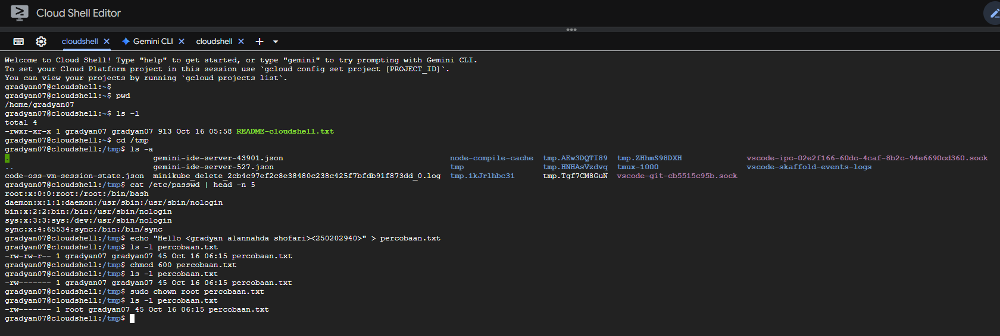

# Laporan Praktikum Minggu 3
Topik: Manajemen File dan Permission di Linux
---

## Identitas
- **Nama**  : Gradyan Alannahda Shofari  
- **NIM**   : 250202940  
- **Kelas** : 1IKRB

---

## Tujuan
Tujuannya adalah untuk meningkatkan keterampilan mahasiswa dalam mengelola file dan direktori di Linux, serta memahami cara mengatur hak akses dan permission dengan baik.

---

## Dasar Teori
Pada praktikum minggu ini, mahasiswa akan mempelajari pengelolaan file dan direktori menggunakan perintah dasar Linux, serta konsep permission dan ownership.
Praktikum berfokus pada:

1. Navigasi sistem file dengan ls, pwd, cd, dan cat.
2. Pengaturan hak akses file menggunakan chmod.
3. Pengubahan kepemilikan file menggunakan chown.
4. Dokumentasi hasil eksekusi dan pengelolaan repositori praktikum.
---

## Langkah Praktikum
Setup Environment

Gunakan Linux (Ubuntu/WSL).
Pastikan folder kerja berada di dalam direktori repositori Git praktikum:
praktikum/week3-linux-fs-permission/
Eksperimen 1 – Navigasi Sistem File Jalankan perintah berikut:

```bash
pwd
ls -l
cd /tmp
ls -a
```

Jelaskan hasil tiap perintah.
Catat direktori aktif, isi folder, dan file tersembunyi (jika ada).

Eksperimen 2 – Membaca File Jalankan perintah:

cat /etc/passwd | head -n 5
Jelaskan isi file dan struktur barisnya (user, UID, GID, home, shell).
Eksperimen 3 – Permission & Ownership Buat file baru:
```bash
echo "Hello <NAME><NIM>" > percobaan.txt
ls -l percobaan.txt
chmod 600 percobaan.txt
ls -l percobaan.txt
```
Analisis perbedaan sebelum dan sesudah chmod.
Ubah pemilik file (jika memiliki izin sudo):
```bash
sudo chown root percobaan.txt
ls -l percobaan.txt
```
Catat hasilnya.
Eksperimen 4 – Dokumentasi

Ambil screenshot hasil terminal dan simpan di:
praktikum/week3-linux-fs-permission/screenshots/
Tambahkan analisis hasil pada laporan.md.
Commit & Push
```bash
git add .
git commit -m "Minggu 3 - Linux File System & Permission"
git push origin main
```
---

## Kode / Perintah
Tuliskan potongan kode atau perintah utama:
```bash
pwd
ls -l
cd /tmp
ls -a
cat /etc/passwd | head -n 5
echo "Hello <NAME><NIM>" > percobaan.txt
ls -l percobaan.txt
chmod 600 percobaan.txt
ls -l percobaan.txt
sudo chown root percobaan.txt
ls -l percobaan.txt
```

---

## Hasil Eksekusi
Sertakan screenshot hasil percobaan atau diagram:


## Eksperimen 1 - Navigasi Sistem File

| Perintah | hasil | penjelasan |
|---------|-----------------------|-----------------------|
| `pwd` | `/home/gradyan07  ` | pwd adalah perintah untuk menampilkan direktori kerja saat ini di Linux. Singkatan dari "Print Working Directory", perintah ini membantu Anda mengetahui lokasi direktori yang sedang Anda akses. Contoh: /home/user/dokumen. |
| `ls -l`               |  `-rwxr-xr-x 1 gradyan07 gradyan07 913 Oct 18 15:17 README-cloudshell.txt`                   | Mengatur alokasi memori dinamis untuk program, sehingga program dapat meminta lebih banyak memori jika diperlukan.  |
| `cd /tmp` | (Tidak ada output) | `cd /tmp` digunakan untuk berpindah ke direktori sementara /tmp di Linux. |
| `ls -a` | `cloudcode-temp3BT9k3  code-oss-vm-session-state.json  minikube_delete_2cb4c97ef2c8e38480c238c425f7bfdb91f873dd_0.log  tmp.2jnl6ehtMI  tmp.tvbdxH71dd              vscode-ipc-3faba241-57c3-4d54-849d-31afda834b51.sock  cloudcode-temp7PC67z  gemini-ide-server-37111.json    node-compile-cache                                              tmp.b9FBx6mDM1  tmux-1000                   vscode-skaffold-events-logscloudcode-temp1jj67o  cloudcode-tempIRgjw6  gemini-ide-server-466.json      tmp` | perintah untuk menampilkan daftar file dan direktori di Linux, termasuk file dan direktori yang tersembunyi (hidden files).  |


### 1. Direktori Aktif (Working Directory)
Direktori aktif saat ini adalah /home/gradyan07. Ini terlihat dari output perintah pwd (print working directory) di awal.


### 2. Isi Folder (Terlihat dari hasil /tmp):

File-file yang tercantum di /tmp (yang bukan file tersembunyi):

- `gemini-ide-server-43901.json`
- `gemini-ide-server-537.json`
- `MiniKube_delete_2c54c5f2ec9e400c235c425c7d8d6f6578dd_0.log`
- `node-compile-cache`
- `tmp`
- `tmp.1rJrihbcO1`
- `tmp.4kQVQ7lZo`
- `tmp.BNAEaOrRq`
- `tmp.TfFGk5Gah`
- `tmp.ZHMMSH00fE`
- `tmux-1000`
- `vs-code-oss-git-cbb5515c99a.sock`
- `vscode-ipc-02e21f6e-5da8-4ea4-8e2c-94e66903c001.sock`
- `vscode-skaffold-events-logs`

### 3. File/Direktori Tersembunyi (Terlihat dari hasil /tmp):

File atau direktori yang namanya diawali dengan titik (.) seperti:

- `.bashrc`
- `.ssh`

## Eksperimen 2 - Membaca File
**Struktur Baris File `/etc/passwd`**

Setiap baris memiliki struktur tetap, `user:password:UID:GID:gecos:home_dir:shell`, dengan rincian sebagai berikut:
| Posisi | Contoh Nilai | Nama Bidang | Keterangan Fungsi |
|---|------|-----------|------------------|
| 1 | `root` | Username | Nama panggilan unik yang digunakan untuk login dan identifikasi. |
| 2 | `x` | Password Placeholder | Indikator keamanan. Karakter x berarti hash kata sandi yang terenkripsi telah dipindahkan ke file /etc/shadow. |
| 3 | `0` | UID (User ID) | Nomor ID Pengguna. UID 0 adalah reservasi mutlak untuk pengguna root (administrator/superuser), memberikan izin tertinggi pada sistem. |
| 4 | `0` | GID (Group ID) | Nomor ID Grup utama (Primary Group ID) yang menjadi milik pengguna ini saat dibuat. |
| 5 | `root` | GECOS/Comment | Bidang opsional untuk informasi tambahan seperti nama lengkap, nomor kontak, dll. (misalnya, Nama Lengkap Pengguna,Ruangan,Telepon Kerja,Telepon Rumah). |
| 6 | `/root` | Home Directory | Direktori tempat pengguna memulai saat login interaktif. |
| 7 | `/bin/bash` | Login Shell | Program yang dijalankan saat pengguna login. /bin/bash adalah shell interaktif yang umum. Nilai seperti /usr/sbin/nologin atau /bin/sync (seperti pada contoh daemon dan sync) secara efektif menonaktifkan login interaktif ke sistem untuk akun-akun layanan (service accounts) atau sistem.. |

**Isi File Lima Baris Pertama**

1. `root`: Administrator utama (UID 0/GID 0). Shell /bin/bash memungkinkan login interaktif.
2. `daemon`: Akun layanan latar belakang. Shell /usr/sbin/nologin mencegah login interaktif.
3. `bin`: Akun kepemilikan file biner. Shell /usr/sbin/nologin mencegah login interaktif.
4. `sys`: Akun terkait proses sistem. Shell /usr/sbin/nologin mencegah login interaktif.
5. `sync`: Akun sinkronisasi data. Shell /bin/sync mencegah login interaktif (hanya menjalankan sync lalu keluar).

## Eksperimen 3 - Permission & Ownership
1. Analisis perbedaan sebelum dan sesudah `chmod`

   Eksperimen ini membandingkan status file percobaan.txt saat baru dibuat dengan statusnya setelah diterapkan perintah chmod 600.

* Sebelum `chmod 600`
* Perintah: `ls -l percobaan.txt`

### A. Status Sebelum Perubahan (chmod 600)

| Output Izin | Pemilik | Grup | Izin Teks | Penjelasan |
|---------|------|-----------|-------|--------|
| -rw-rw-r-- | `gradyan07` | `gradyan07` | 664 | 664 berarti Owner (6) dapat Membaca dan Menulis (rw), Group (6) dapat Membaca dan Menulis (rw), dan Others (4) hanya dapat Membaca (r). |

* Sesudah `chmod 600 percobaan.txt`
* Perintah: `ls -l percobaan.txt`

### B. Status Setelah Perubahan (chmod 600)

| Output Izin | Pemilik | Grup | Izin Teks | Perubahan | 
|---------|------|-----------|-------|--------|
| `-rw-------` | `root` | `gradyan07` | 600 | 600 berarti Owner (6) dapat Membaca dan Menulis (rw), Group (0) tidak memiliki Izin (---), dan Others (0) tidak memiliki Izin (---). |

### Kesimpulan
Kesimpulan A:

 File ini awalnya memberikan hak baca/tulis kepada pemilik dan grup, serta hak baca saja kepada pengguna lain (others) di luar grup tersebut.

Kesimpulan B:

Izin Akses Berubah: Izin akses berhasil diubah menjadi 600 (-rw-------). Kini, Hanya Pemilik (root) yang memiliki hak Baca dan Tulis. Grup dan Pengguna Lain sama sekali tidak memiliki izin.

Kepemilikan Berubah: Terjadi perubahan kepemilikan (ownership). File kini dimiliki oleh root padahal perintah yang dieksekusi hanyalah chmod. Perubahan kepemilikan ini tidak mungkin terjadi hanya dengan perintah chmod 600. Ini menunjukkan bahwa sebelum perintah ls -l yang kedua dieksekusi, pasti ada perintah sudo chown root percobaan.txt (atau sejenisnya) yang dieksekusi, namun perintah tersebut tidak ditampilkan dalam eksperimen ini.


## Analisis
- Jelaskan makna hasil percobaan.  

1. Pengguna dapat membuat, menghapus, dan mengelola file dan direktori dengan perintah-perintah Linux.
2. Pengaturan permission (hak akses) dapat membatasi akses pengguna lain ke file dan direktori.
3. Perubahan ownership (kepemilikan) file dan direktori dapat mempengaruhi hak akses.

    Hasil percobaan ini membantu memahami konsep manajemen file dan permission di Linux secara praktis.
- Hubungkan hasil dengan teori (fungsi kernel, system call, arsitektur OS).

1. Fungsi Kernel: Kernel Linux mengatur manajemen file dan permission dengan menyediakan sistem file dan mengatur hak akses.
2. System Call: Perintah-perintah Linux seperti mkdir, rm, chmod, dan chown menggunakan system call untuk meminta layanan kernel dalam mengelola file dan direktori.
3. Arsitektur OS: Struktur direktori dan file system di Linux (seperti EXT4) merupakan implementasi dari konsep arsitektur sistem operasi yang mengatur bagaimana data disimpan dan diakses.

- Apa perbedaan hasil di lingkungan OS berbeda (Linux vs Windows)?  

1. Sintaks perintah berbeda (Linux menggunakan chmod, chown, sedangkan Windows menggunakan GUI atau perintah icacls).
2. Struktur direktori berbeda (Linux menggunakan /home, /root, sedangkan Windows menggunakan C:\Users).
3. Sistem permission berbeda (Linux menggunakan permission berbasis user/group/other, sedangkan Windows menggunakan ACL).

---

## Kesimpulan
1. Perintah dasar seperti mkdir, rm, cp, dan mv digunakan untuk mengelola file dan direktori di Linux.
2. Sistem permission Linux memungkinkan pengaturan hak akses file dan direktori berdasarkan user, group, dan other untuk meningkatkan keamanan.
3. Pengaturan permission yang tepat dapat melindungi data dari akses tidak sah dan meningkatkan keamanan sistem secara keseluruhan.

---

## Quiz
1. Apa fungsi dari perintah chmod?

   Fungsi dari perintah chmod adalah untuk mengubah izin akses (permission) pada file atau direktori di sistem operasi Unix/Linux. Dengan chmod, Anda dapat menentukan siapa yang dapat membaca, menulis, atau mengeksekusi file atau direktori tertentu, sehingga meningkatkan keamanan dan kontrol akses pada sistem. 

2. Apa arti dari kode permission rwxr-xr--?

   Kode permission rwxr-xr-- adalah representasi dari izin akses file atau direktori di sistem operasi Unix/Linux. Berikut adalah arti dari kode tersebut:

- rwx (Owner/User): Membaca (r), Menulis (w), dan Mengeksekusi (x)
- r-x (Group): Membaca (r) dan Mengeksekusi (x), tapi tidak dapat Menulis
- r-- (Other): Hanya dapat Membaca (r), tidak dapat Menulis atau Mengeksekusi

Jadi, kode rwxr-xr-- berarti:

- Pemilik file memiliki izin penuh (membaca, menulis, dan mengeksekusi)
- Anggota grup memiliki izin membaca dan mengeksekusi, tapi tidak dapat menulis
- Pengguna lain hanya dapat membaca file, tidak dapat menulis atau mengeksekusi.

3. Jelaskan perbedaan antara chown dan chmod.

   chown dan chmod adalah dua perintah yang berbeda dalam sistem operasi Unix/Linux.
chown digunakan untuk mengubah kepemilikan file atau direktori, yaitu mengubah siapa yang memiliki file atau direktori tersebut.
chmod digunakan untuk mengubah izin akses file atau direktori, yaitu menentukan siapa yang dapat membaca, menulis, atau mengeksekusi file atau direktori tersebut.

Jadi, chown berkaitan dengan kepemilikan, sedangkan chmod berkaitan dengan izin akses.

---

## Refleksi Diri
Tuliskan secara singkat:
- Apa bagian yang paling menantang minggu ini?  
Membuat tabel
- Bagaimana cara Anda mengatasinya?  
Mempelajari cara membuat tabel
---

**Credit:**  
_Template laporan praktikum Sistem Operasi (SO-202501) – Universitas Putra Bangsa_
