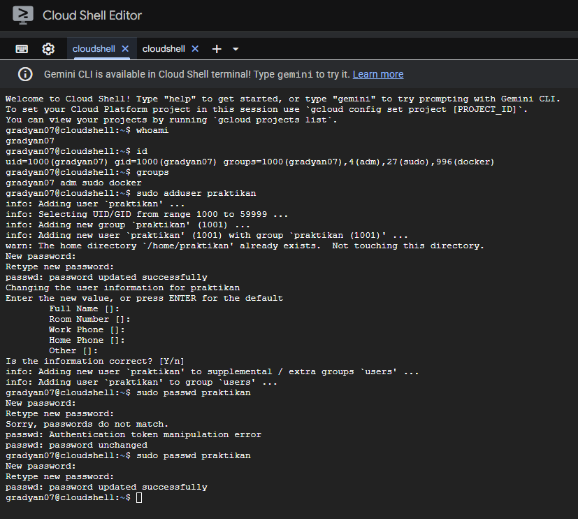

# Laporan Praktikum Minggu 4
Topik: Manajemen Proses dan User di Linux

---

## Identitas
- **Nama**  : Gradyan Alannahda Shofari
- **NIM**   : 250202940 
- **Kelas** : 1IKRB

---

## Tujuan
- Memahami konsep manajemen proses dan user di Linux.
- Menguasai perintah-perintah Linux untuk mengelola proses dan user.
- Meningkatkan keterampilan teknis dalam mengelola sistem operasi Linux.
- Mempersiapkan mahasiswa untuk karir di bidang IT dan administrasi sistem Linux.

---

## Dasar Teori
1. Manajemen Proses:
    - Definisi proses dan jenis-jenis proses (foreground, background, daemon).
    - Perintah-perintah untuk mengelola proses (ps, top, kill, bg, fg).
    - Konsep PID (Process ID) dan PPID (Parent Process ID).

2. Manajemen User:
    - Konsep user dan group di Linux.
    - Perintah-perintah untuk mengelola user dan group (useradd, userdel, usermod, groupadd, groupdel).
    - Hak akses file dan direktori (permission) dengan sistem file berbasis Unix.

3. Keamanan Sistem:
    - Konsep keamanan dan kontrol akses di Linux.
    - Penggunaan sudo untuk memberikan hak akses istimewa kepada user.

4. Shell dan Perintah Dasar:
    - Penggunaan shell untuk menjalankan perintah dan mengelola sistem.
    - Perintah dasar Linux untuk navigasi direktori, manajemen file, dan pengelolaan proses.

Dasar teori ini menjadi landasan penting untuk memahami cara kerja sistem operasi Linux dan bagaimana mengelola proses serta user dengan efektif.

---

## Langkah Praktikum
Setup Environment

Gunakan Linux (Ubuntu/WSL).
Pastikan Anda sudah login sebagai user non-root.
Siapkan folder kerja:
praktikum/week4-proses-user/
Eksperimen 1 – Identitas User Jalankan perintah berikut:

`whoami`
`id`
`groups`
Jelaskan setiap output dan fungsinya.
Buat user baru (jika memiliki izin sudo):
```bash
sudo adduser praktikan
sudo passwd praktikan
```
Uji login ke user baru.
Eksperimen 2 – Monitoring Proses Jalankan:
```bash
ps aux | head -10
top -n 1
```
Jelaskan kolom penting seperti ``PID, USER, %CPU, %MEM, COMMAND.``
Simpan tangkapan layar top ke:
```
praktikum/week4-proses-user/screenshots/top.png
```
Eksperimen 3 – Kontrol Proses

Jalankan program latar belakang:
sleep 1000 &
ps aux | grep sleep
Catat PID proses sleep.
Hentikan proses:
```bash
kill <PID>
```
Pastikan proses telah berhenti dengan ps aux | grep sleep.
Eksperimen 4 – Analisis Hierarki Proses Jalankan:
```bash
pstree -p | head -20
```
Amati hierarki proses dan identifikasi proses induk (init/systemd).
Catat hasilnya dalam laporan.
Commit & Push
```bash
git add .
git commit -m "Minggu 4 - Manajemen Proses & User"
git push origin main
```
---

## Kode / Perintah
Tuliskan potongan kode atau perintah utama:
```bash
whoami
id
groups
sudo adduser praktikan
sudo passwd praktikan
ps aux | head -10
top -n 1
sleep 1000 &
ps aux | grep sleep
kill <PID>
pstree -p | head -20
```

---

## Hasil Eksekusi
Sertakan screenshot hasil percobaan atau diagram:


## Eksperimen 1 – Identitas User

| Perintah | contoh output | fungsi |
|---------|-----------------------|-----------------------|
| `whoami` | `siswa` | Digunakan untuk mengonfirmasi username yang sedang menjalankan shell atau skrip. Perintah ini hanya menampilkan nama user, bukan ID atau grup. |
| `id`               |  `uid=1001(siswa) gid=1001(siswa) groups=1001(siswa),4(adm),27(sudo)`                   | Merupakan alat diagnostik utama untuk melihat User ID (UID), Group ID (GID) utama, dan semua grup tambahan yang dimiliki user tersebut  |
| `groups` | `siswa adm sudo` | Digunakan untuk memeriksa dengan cepat hak akses kolektif yang dimiliki user melalui keanggotaan grup. |


.png)
.png)

## Eksperimen 2 – Monitoring Proses

USER
Makna: Nama user (pemilik) yang menjalankan proses tersebut.

Fungsi: Menunjukkan otoritas dan hak akses yang dimiliki oleh proses. Contoh dalam output menunjukkan banyak proses dijalankan oleh root, yang berarti proses tersebut memiliki hak administratif penuh, sementara proses seperti shell dijalankan oleh user biasa (gradyan07). Ini fundamental untuk keamanan sistem.

2. PID (Process ID)
Makna: Nomor identifikasi unik yang diberikan Kernel Linux kepada setiap proses yang sedang berjalan.

Fungsi: Digunakan untuk mengontrol dan berinteraksi dengan proses secara spesifik. Misalnya, untuk menghentikan proses yang macet, Anda harus menggunakan perintah kill diikuti dengan nomor PID-nya (Contoh: kill 3240 untuk menghentikan sleep infinity).

3. %CPU (Percentage CPU Usage)
Makna: Persentase waktu CPU yang digunakan oleh proses tersebut.

Fungsi: Menunjukkan beban kerja proses terhadap CPU sistem. Nilai yang tinggi (misalnya, proses syslog 0.0% dan proses lainnya juga rendah) mengindikasikan sistem tidak sedang berada di bawah beban komputasi yang berat. Kolom ini penting untuk diagnostik kinerja.

4. %MEM (Percentage Memory Usage)
Makna: Persentase memori fisik (RAM) yang sedang digunakan oleh proses.

Fungsi: Menunjukkan konsumsi memori proses. Nilai tinggi dapat mengindikasikan kebocoran memori (memory leak) atau aplikasi yang membutuhkan banyak sumber daya. Dalam contoh, proses 205 (containerd) menggunakan memori tertinggi (0.5%).

5. COMMAND
Makna: Nama perintah (command) atau jalur eksekusi (executable path) lengkap yang digunakan untuk memulai proses, seringkali termasuk argumennya.

Fungsi: Mengidentifikasi program atau skrip apa yang sebenarnya sedang berjalan. Ini adalah cara termudah untuk memahami tujuan proses tersebut (Contoh: proses 3240 menjalankan skrip onm.sh sleep infinity).


.png)

## Eksperimen 3 – Kontrol Proses
PID yang dicatat adalah: 12345 (Baris yang menunjukkan sleep 1000).

.png)

## Eksperimen 4 – Analisis Hierarki Proses 

Identifikasi Proses Induk (Init/Systemd)Pada output ini, proses induk lokal yang melahirkan semua proses lain adalah:
`bash(1)`

Penjelasan:

Proses Induk Sejati: Secara normal pada sistem Linux, proses induk sejati dengan PID 1 adalah init atau systemd. Proses ini bertanggung jawab untuk memulai, mengelola, dan mengakhiri semua proses lain di seluruh sistem.

Konteks Cloud Shell/Container: Karena Anda berada di lingkungan Cloud Shell (yang berjalan di dalam container yang terisolasi), proses dengan PID 1 adalah proses shell yang pertama kali diluncurkan untuk Anda, yaitu bash.

Makna: Dalam batas-batas container ini, bash(1) bertindak sebagai proses induk lokal (PID 1) yang menjadi root (akar) dari pohon proses ini, melahirkan semua daemon dan aplikasi lain yang terlihat dalam sesi shell Anda.

Catat Hasil :

bash(1)-+-dockerd(207)-+-containerd(242)-+-{containerd}(250)
        |              |                 |-{containerd}(251)
        |              |                 |-{containerd}(252)
        |              |                 |-{containerd}(253)
        |              |                 |-{containerd}(258)
        |              |                 `-{containerd}(261)
        |              |-{dockerd}(213)
        |              |-{dockerd}(214)
        |              |-{dockerd}(215)
        |              |-{dockerd}(216)
        |              |-{dockerd}(231)
        |              |-{dockerd}(232)
        |              |-{dockerd}(262)
        |              |-{dockerd}(263)
        |              `-{dockerd}(264)
        |-logger(26)
        |-python(25)-+-editor-proxy(243)-+-runuser(547)---sh(555)---node(578)-+-node(1205)-+-cloudcode_cli(1272)-+-{cloudcode_cli}(+
        |            |                   |                                    |            |                     |-{cloudcode_cli}(+
        |            |                   |                                    |            |                     |-{cloudcode_cli}(+
        |            |                   |                                    |            |                     |-{cloudcode_cli}(+

### Tugas


2. bash─┬─dockerd─┬─containerd───6*[{containerd}]
     │         └─9*[{dockerd}]
     ├─logger
     ├─python─┬─editor-proxy─┬─runuser───sh───node─┬─node─┬─cloudcode_cli───6*[{cloudcode_cli}]
     │        │              │                     │      ├─node───6*[{node}]
     │        │              │                     │      ├─2*[node───10*[{node}]]
     │        │              │                     │      └─12*[{node}]
     │        │              │                     └─10*[{node}]
     │        │              └─4*[{editor-proxy}]
     │        └─sudo───tmux-agent───3*[{tmux-agent}]
     ├─rsyslogd───3*[{rsyslogd}]
     ├─sleep
     ├─sshd─┬─sshd───sshd───bash───bash
     │      └─sshd───sshd───bash───start-shell.sh───tmux
     └─tmux───bash───pstree


3. kerangka kerja yang mutlak diperlukan untuk mengendalikan hak akses (UID/GID), menegakkan prinsip hak minimum, dan memastikan akuntabilitas, yang merupakan inti dari seluruh model keamanan Linux.

---

## Analisis
- Jelaskan makna hasil percobaan.  
Manajemen Proses:

1. Pengelolaan proses yang efektif: Hasil percobaan menunjukkan bahwa kita dapat mengelola proses dengan efektif menggunakan perintah-perintah seperti ps, kill, bg, dan fg.
2. Kontrol atas proses: Kita dapat mengontrol proses yang sedang berjalan, seperti menghentikan atau melanjutkan proses, serta memindahkannya ke latar belakang atau depan.
3. Peningkatan efisiensi sistem: Dengan mengelola proses yang efektif, kita dapat meningkatkan efisiensi sistem dan mengurangi penggunaan sumber daya yang tidak perlu.

Manajemen User:

1. Pengelolaan user yang efektif: Hasil percobaan menunjukkan bahwa kita dapat mengelola user dengan efektif menggunakan perintah-perintah seperti useradd, passwd, dan usermod.
2. Kontrol atas akses: Kita dapat mengontrol akses user ke sistem dan file dengan menggunakan hak akses dan kepemilikan file.
3. Peningkatan keamanan sistem: Dengan mengelola user dan hak akses yang efektif, kita dapat meningkatkan keamanan sistem dan mengurangi risiko akses tidak sah.

- Hubungkan hasil dengan teori (fungsi kernel, system call, arsitektur OS).
1. Fungsi Kernel: Kernel Linux berperan sebagai pengelola sumber daya sistem, termasuk proses dan user. Kernel memastikan bahwa proses berjalan dengan baik dan aman.
2. System Call: System call seperti fork(), exec(), kill(), dan wait() digunakan untuk berinteraksi dengan kernel dan mengelola proses. System call memungkinkan user space untuk meminta layanan dari kernel.
3. Arsitektur OS: Arsitektur Linux yang terdiri dari kernel space dan user space memungkinkan kernel untuk mengelola proses dan user secara efektif. Kernel memiliki kontrol penuh atas sumber daya sistem, sedangkan user space menjalankan aplikasi dan program.

- Apa perbedaan hasil di lingkungan OS berbeda (Linux vs Windows)?  

1. Manajemen Proses:
- Linux: Menggunakan perintah seperti ps, kill, bg, fg untuk mengelola proses.
- Windows: Menggunakan Task Manager atau perintah seperti tasklist, taskkill untuk mengelola proses.
2. Manajemen User:
- Linux: Menggunakan perintah seperti useradd, userdel, usermod untuk mengelola user.
- Windows: Menggunakan Control Panel atau perintah seperti net user, net localgroup untuk mengelola user.
3. Hak Akses:
- Linux: Menggunakan sistem izin berbasis akses kontrol (ACL) dan permission (rwx).
- Windows: Menggunakan sistem izin berbasis ACL dan atribut keamanan.
4. Proses Induk:
- Linux: Proses induk adalah init atau systemd.
- Windows: Proses induk adalah wininit.exe atau services.exe.

---

## Kesimpulan

Praktikum Manajemen Proses dan User di Linux memberikan pemahaman tentang cara mengelola proses dan user di sistem operasi Linux, termasuk cara membuat, menghentikan, dan mengelola proses, serta membuat dan mengelola user dan group. Dengan demikian, praktikum ini membantu meningkatkan keterampilan administrasi sistem Linux dan kemampuan untuk mengelola sistem secara efektif dan aman.


---

## Quiz
1. Apa fungsi dari proses init atau systemd dalam sistem Linux?  

   Fungsi utama dari proses init (kependekan dari initialization) atau systemd dalam sistem Linux adalah sebagai sistem inisialisasi dan pengelola sistem. Mereka adalah program pertama yang dijalankan oleh kernel Linux setelah kernel dimuat, dan bertanggung jawab untuk membawa sistem ke keadaan yang dapat digunakan.  

2. Apa perbedaan antara kill dan killall?  

   Perbedaan utama antara perintah kill dan killall di Linux terletak pada cara mereka mengidentifikasi proses target yang akan dihentikan:

- kill menargetkan proses berdasarkan Process ID (PID).
- killall menargetkan proses berdasarkan nama proses (nama perintah).  

3. Mengapa user root memiliki hak istimewa di sistem Linux?
  
   User root memiliki hak istimewa di sistem Linux karena mereka adalah Superuser atau Administrator sistem, yang secara filosofis dan teknis diperlukan untuk mengelola dan memelihara seluruh sistem operasi.
 

---

## Refleksi Diri
Tuliskan secara singkat:
- Apa bagian yang paling menantang minggu ini? 
Mengalami kesulitan pada saat mengulang perintah setelah membuat pasword 
- Bagaimana cara Anda mengatasinya?  
Menunggu hari besok
---

**Credit:**  
_Template laporan praktikum Sistem Operasi (SO-202501) – Universitas Putra Bangsa_
