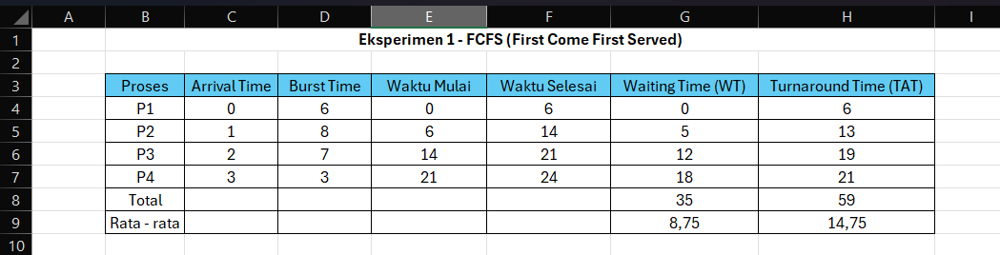
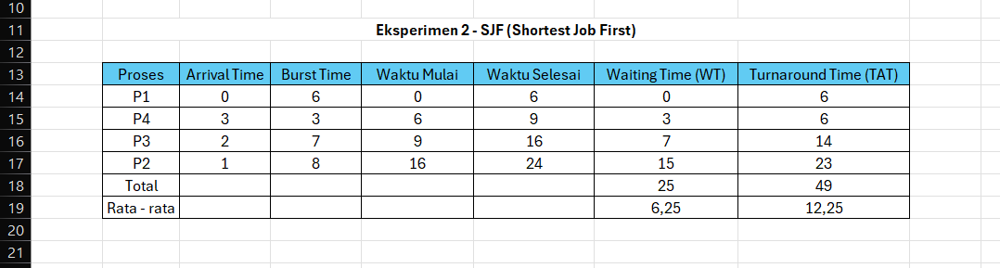

# Laporan Praktikum Minggu 5
Topik: Penjadwalan CPU – FCFS dan SJF

---

## Identitas
- **Nama**  : Gradyan Alannahda Shofari 
- **NIM**   : 250202940 
- **Kelas** : 1IKRB

---

## Tujuan

Tujuan mahasiswa melakukan praktikum tentang Penjadwalan CPU – FCFS dan SJF adalah untuk memahami, mengimplementasikan, dan menganalisis kinerja kedua algoritma penjadwalan CPU tersebut.

---

## Dasar Teori
1. Penjadwalan CPU: Proses pengelolaan dan pengalokasian waktu CPU untuk menjalankan proses-proses yang ada di sistem operasi.
2. FCFS (First Come First Served): Algoritma penjadwalan CPU yang melayani proses berdasarkan urutan kedatangan, yaitu proses yang datang pertama kali akan dilayani pertama kali.
3. SJF (Shortest Job First): Algoritma penjadwalan CPU yang melayani proses berdasarkan waktu eksekusi terpendek, yaitu proses dengan waktu eksekusi terpendek akan dilayani pertama kali.
4. Kriteria Penjadwalan CPU: Waktu tunggu (waiting time), waktu respons (response time), throughput sistem, dan efisiensi penggunaan CPU digunakan untuk mengevaluasi kinerja algoritma penjadwalan CPU.

---

## Langkah Praktikum

1. **Siapkan Data Proses**
   Gunakan tabel proses berikut sebagai contoh (boleh dimodifikasi dengan data baru):
   | Proses | Burst Time | Arrival Time |
   |:--:|:--:|:--:|
   | P1 | 6 | 0 |
   | P2 | 8 | 1 |
   | P3 | 7 | 2 |
   | P4 | 3 | 3 |

2. **Eksperimen 1 – FCFS (First Come First Served)**
   - Urutkan proses berdasarkan *Arrival Time*.  
   - Hitung nilai berikut untuk tiap proses:
     ```
     Waiting Time (WT) = waktu mulai eksekusi - Arrival Time
     Turnaround Time (TAT) = WT + Burst Time
     ```
   - Hitung rata-rata Waiting Time dan Turnaround Time.  
   - Buat Gantt Chart sederhana:  
     ```
     | P1 | P2 | P3 | P4 |
     0    6    14   21   24
     ```

3. **Eksperimen 2 – SJF (Shortest Job First)**
   - Urutkan proses berdasarkan *Burst Time* terpendek (dengan memperhatikan waktu kedatangan).  
   - Lakukan perhitungan WT dan TAT seperti langkah sebelumnya.  
   - Bandingkan hasil FCFS dan SJF pada tabel berikut:

     | Algoritma | Avg Waiting Time | Avg Turnaround Time | Kelebihan | Kekurangan |
     |------------|------------------|----------------------|------------|-------------|
     | FCFS | ... | ... | Sederhana dan mudah diterapkan | Tidak efisien untuk proses panjang |
     | SJF | ... | ... | Optimal untuk job pendek | Menyebabkan *starvation* pada job panjang |

4. **Eksperimen 3 – Visualisasi Spreadsheet (Opsional)**
   - Gunakan Excel/Google Sheets untuk membuat perhitungan otomatis:
     - Kolom: Arrival, Burst, Start, Waiting, Turnaround, Finish.
     - Gunakan formula dasar penjumlahan/subtraksi.
   - Screenshot hasil perhitungan dan simpan di:
     ```
     praktikum/week5-scheduling-fcfs-sjf/screenshots/
     ```

5. **Analisis**
   - Bandingkan hasil rata-rata WT dan TAT antara FCFS & SJF.  
   - Jelaskan kondisi kapan SJF lebih unggul dari FCFS dan sebaliknya.  
   - Tambahkan kesimpulan singkat di akhir laporan.

6. **Commit & Push**
   ```bash
   git add .
   git commit -m "Minggu 5 - CPU Scheduling FCFS & SJF"
   git push origin main
   ```

---

## Kode / Perintah
Tuliskan potongan kode atau perintah utama:
```bash
Waiting Time (WT) = waktu mulai eksekusi - Arrival Time
Turnaround Time (TAT) = WT + Burst Time
```

---

## Tugas
2 skenario FCFS dan SJF :


---
## Hasil Eksekusi
Sertakan screenshot hasil percobaan atau diagram:


---

## Eksperimen 1 FCFS (First Come First Served)
Urutan proses berdasarkan Arrival Time: P1 -> P2 -> P3 -> P4
- Tabel FCFS


- Gantt Chart FCFS:
```Bash
| P1 | P2 | P3 | P4 |
0    6    14   21   24
```
## Eksperimen 2 - SJF (Shortest Job First)
Urutan proses berdasarkan Burst Time terpendek (dengan memperhatikan waktu kedatangan): P1 -> P4 -> P3 -> P2
- Tabel SJF

- Gantt Chart SJF:
```bash
| P1 | P4 | P3 | P2 |
0    6    9   16   24
```

## Perbandingan hasil FCFS dan SJF:

   | Algoritma | Avg Waiting Time | Avg Turnaround Time | Kelebihan | Kekurangan |
   | ------------|------------------|----------------------|------------|-------------|
| FCFS | 8,75 | 14,75 | Sederhana dan mudah diterapkan | Tidak efisien untuk proses panjang |
| SJF | 6,25 | 12,25 | Optimal untuk job pendek | Menyebabkan *starvation* pada job panjang |

---


## Analisis
- Bandingkan hasil rata-rata WT dan TAT antara FCFS & SJF.  
Rata-rata Waiting Time (WT):
- SJF memiliki rata-rata Waiting Time yang lebih rendah (6,25) dibandingkan dengan FCFS (8,75).
- Perbedaan: $8,75 - 6,25 = \mathbf{2,5}$
Rata-rata Turnaround Time (TAT):
- SJF juga memiliki rata-rata Turnaround Time yang lebih rendah (12,25) dibandingkan dengan FCFS (14,75).
- Perbedaan: $14,75 - 12,25 = \mathbf{2,5}$

- Jelaskan kondisi kapan SJF lebih unggul dari FCFS dan sebaliknya.
a. unggul dalam efisiensi kinerja (rata-rata WT/TAT rendah), tetapi memiliki masalah kepraktisan (butuh prediksi waktu burst) dan risiko ketidakadilan (starvation).
b. FCFS unggul dalam keadilan, kepastian (fairness), dan kepraktisan (tidak butuh prediksi), tetapi menghasilkan kinerja rata-rata yang lebih buruk (WT/TAT tinggi).


- Tambahkan kesimpulan singkat di akhir laporan.  

---

## Kesimpulan
1. Efisiensi Waktu: SJF memiliki keunggulan performa karena dirancang untuk meminimalkan rata-rata Waiting Time (WT) dan Turnaround Time (TAT), menghasilkan waktu respons yang lebih baik secara keseluruhan.
2. Keadilan (Fairness) vs. Starvation: FCFS adalah algoritma yang paling adil dan menjamin tidak ada starvation. Sebaliknya, SJF dapat menyebabkan starvation pada proses yang membutuhkan waktu lama.
3. Kepraktisan: FCFS adalah yang paling praktis karena hanya bergantung pada waktu kedatangan. SJF tidak praktis karena memerlukan prediksi waktu burst (waktu eksekusi) yang akurat.

---

## Quiz
1. Apa perbedaan utama antara FCFS dan SJF?

   Perbedaan utama antara FCFS (First Come First Served) dan SJF (Shortest Job First) adalah FCFS memproses proses berdasarkan urutan kedatangannya, sementara SJF memproses proses dengan waktu eksekusi terpendek terlebih dahulu. Akibatnya, FCFS lebih sederhana tetapi bisa menyebabkan waktu tunggu yang lebih lama bagi proses yang tiba belakangan, sedangkan SJF bertujuan untuk meminimalkan waktu tunggu rata-rata, meskipun lebih kompleks untuk diimplementasikan.   

2. Mengapa SJF dapat menghasilkan rata-rata waktu tunggu minimum?

   Algoritma Shortest Job First (SJF) dapat menghasilkan rata-rata waktu tunggu minimum karena sifatnya yang greedy, yaitu selalu mengeksekusi proses dengan waktu eksekusi terpendek terlebih dahulu. Pendekatan ini memastikan bahwa proses-proses yang lebih pendek tidak harus menunggu lama di belakang proses-proses yang lebih panjang. 

3. Apa kelemahan SJF jika diterapkan pada sistem interaktif?  

   Kelemahan SJF pada sistem interaktif:

- Dapat menyebabkan starvation untuk proses panjang.
- Sulit memprediksi burst time secara akurat.
- Respons ke pengguna bisa lambat untuk proses panjang.
- Membutuhkan overhead untuk estimasi waktu eksekusi.  

---

## Refleksi Diri
Tuliskan secara singkat:
- Apa bagian yang paling menantang minggu ini?  
Menganalisis cara membuat di excel
- Bagaimana cara Anda mengatasinya?  
Memahami caranya mengerjakannya
---

**Credit:**  
_Template laporan praktikum Sistem Operasi (SO-202501) – Universitas Putra Bangsa_
