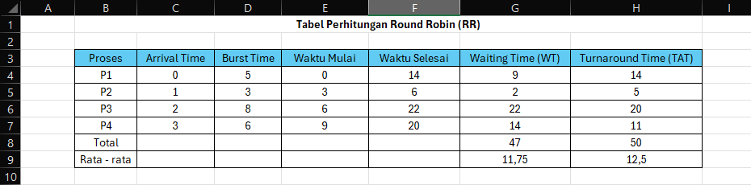

# Laporan Praktikum Minggu 6
Topik: Penjadwalan CPU – Round Robin (RR) dan Priority Scheduling

---

## Identitas
- **Nama**  : Gradyan Alannahda Shofari  
- **NIM**   : 250202940
- **Kelas** : 1IKRB

---

## Tujuan

1. **Memahami konsep dasar** algoritma penjadwalan CPU, khususnya Round Robin dan Priority Scheduling.  
2. **Menganalisis perbedaan kinerja** kedua algoritma berdasarkan waktu tunggu, waktu respons, dan throughput.  
3. **Mengevaluasi kelebihan dan kekurangan** masing-masing algoritma dalam berbagai skenario sistem operasi.  
4. **Melatih kemampuan simulasi dan analisis**, baik secara manual maupun menggunakan perangkat lunak pendukung.

---

## Dasar Teori

1. **Round Robin (RR):**  
   Algoritma ini menggunakan time quantum untuk membagi waktu CPU secara bergiliran ke setiap proses, cocok untuk sistem time-sharing.

2. **Priority Scheduling:**  
   Proses dijalankan berdasarkan tingkat prioritas. Proses dengan prioritas lebih tinggi mendapat akses CPU lebih dulu.

3. **Time Quantum:**  
   Ukuran time quantum memengaruhi efisiensi dan responsivitas sistem. Terlalu kecil → overhead tinggi; terlalu besar → proses pendek tertunda.

4. **Starvation:**  
   Pada Priority Scheduling, proses prioritas rendah bisa tidak pernah dijalankan jika selalu ada proses prioritas tinggi.

5. **Pemilihan Algoritma:**  
   Harus disesuaikan dengan kebutuhan sistem, apakah lebih mementingkan keadilan, efisiensi, atau penanganan proses penting.


---

## Langkah Praktikum
1. **Siapkan Data Proses**
   Gunakan contoh data berikut (boleh dimodifikasi sesuai kebutuhan):
   | Proses | Burst Time | Arrival Time | Priority |
   |:--:|:--:|:--:|:--:|
   | P1 | 5 | 0 | 2 |
   | P2 | 3 | 1 | 1 |
   | P3 | 8 | 2 | 4 |
   | P4 | 6 | 3 | 3 |

2. **Eksperimen 1 – Round Robin (RR)**
   - Gunakan *time quantum (q)* = 3.  
   - Hitung *waiting time* dan *turnaround time* untuk tiap proses.  
   - Simulasikan eksekusi menggunakan Gantt Chart (manual atau spreadsheet).  
     ```
     | P1 | P2 | P3 | P4 | P1 | P3 | ...
     0    3    6    9   12   15   18  ...
     ```
   - Catat sisa *burst time* tiap putaran.

3. **Eksperimen 2 – Priority Scheduling (Non-Preemptive)**
   - Urutkan proses berdasarkan nilai prioritas (angka kecil = prioritas tinggi).  
   - Lakukan perhitungan manual untuk:
     ```
     WT[i] = waktu mulai eksekusi - Arrival[i]
     TAT[i] = WT[i] + Burst[i]
     ```
   - Buat tabel perbandingan hasil RR dan Priority.

4. **Eksperimen 3 – Analisis Variasi Time Quantum (Opsional)**
   - Ubah *quantum* menjadi 2 dan 5.  
   - Amati perubahan nilai rata-rata *waiting time* dan *turnaround time*.  
   - Buat tabel perbandingan efek *quantum*.

5. **Eksperimen 4 – Dokumentasi**
   - Simpan semua hasil tabel dan screenshot ke:
     ```
     praktikum/week6-scheduling-rr-priority/screenshots/
     ```
   - Buat tabel perbandingan seperti berikut:

     | Algoritma | Avg Waiting Time | Avg Turnaround Time | Kelebihan | Kekurangan |
     |------------|------------------|----------------------|------------|-------------|
     | RR | ... | ... | Adil terhadap semua proses | Tidak efisien jika quantum tidak tepat |
     | Priority | ... | ... | Efisien untuk proses penting | Potensi *starvation* pada prioritas rendah |

6. **Commit & Push**
   ```bash
   git add .
   git commit -m "Minggu 6 - CPU Scheduling RR & Priority"
   git push origin main
   ```

---

## Kode / Perintah
Tuliskan potongan kode atau perintah utama:
```bash
WT[i] = waktu mulai eksekusi - Arrival[i]
TAT[i] = WT[i] + Burst[i]
```
---

## Hasil Eksekusi

- Tabel Round Robin (RR) & Priority Scheduling


## Eksperimen 1 Round Robin (RR) 

- Tabel Round Robin (RR)


- Gantt Chart FCFS:
```Bash
| P1 | P2 | P3 | P4 | P1 | P3 | P4 | P4 |
0    3    6   9   12   15    18   21  24  
```

## Eksperimen 2 Priority Scheduling

- Tabel Priority Scheduling


- Gantt Chart FCFS:
```Bash
| P1 | P2 | P4 | P3 |
0    5    8   14   22
```
## Tabel Perbandingan

| Algoritma | Avg Waiting Time | Avg Turnaround Time | Kelebihan | Kekurangan |
|------------|------------------|----------------------|------------|-------------|
| RR | 11,75 | 12,5 | Adil terhadap semua proses | Tidak efisien jika quantum tidak tepat |
| Priority | 5,25 | 10,75 | Efisien untuk proses penting | Potensi *starvation* pada prioritas rendah |

---

## Analisis

### Bandingkan performa dan jelaskan pengaruh time quantum serta prioritas.

**Perbandingan Round Robin vs Priority Scheduling & Pengaruh Parameter**

- **Round Robin (RR)**: Cocok untuk sistem interaktif. Memberi giliran eksekusi merata. Responsif, tapi bisa boros CPU jika time quantum terlalu kecil.

- **Priority Scheduling**: Menjalankan proses berdasarkan prioritas. Efisien untuk proses penting, tapi bisa menyebabkan starvation jika tidak ada mekanisme aging.

- **Pengaruh Time Quantum (RR)**:
  - Terlalu kecil → banyak context switching, boros sumber daya.
  - Terlalu besar → proses pendek jadi lambat, mirip FCFS.

- **Pengaruh Prioritas**:
  - Prioritas tinggi → proses cepat selesai.
  - Prioritas rendah → bisa tertunda lama tanpa aging.

**Kesimpulan**: RR unggul dalam keadilan dan responsivitas, Priority lebih efisien untuk proses kritis. Pengaturan time quantum dan prioritas sangat memengaruhi performa.


---

## Kesimpulan

**Kesimpulan Praktikum Penjadwalan CPU – RR & Priority**

- **Round Robin (RR)**: Memberi jatah waktu eksekusi bergiliran. Cocok untuk sistem multitasking. Kelemahan: terlalu banyak context switching jika time quantum kecil.

- **Priority Scheduling**: Proses dijalankan berdasarkan prioritas. Efisien untuk proses penting, tapi bisa menyebabkan starvation pada proses prioritas rendah.

- **Kesimpulan**: RR lebih adil dan responsif, Priority lebih efisien untuk proses kritis. Pemilihan algoritma harus disesuaikan dengan kebutuhan sistem.


---

## Quiz
1. Apa perbedaan utama antara Round Robin dan Priority Scheduling?

   - Round Robin: Proses dijalankan bergiliran dengan jatah waktu tetap (time quantum). Adil, cocok untuk sistem time-sharing, tidak ada risiko starvation.
   - Priority Scheduling: Proses dengan prioritas tertinggi dijalankan lebih dulu. Tidak adil, bisa menyebabkan starvation, cocok untuk sistem real-time.


2. Apa pengaruh besar/kecilnya time quantum terhadap performa sistem?

   Pengaruh besar/kecilnya time quantum terhadap performa sistem:

- Time quantum kecil:
  + Banyak context switching → overhead tinggi.  
  + Respons cepat, tapi efisiensi rendah.

- Time quantum besar:* 
  + Proses pendek harus menunggu lama.  
  + Efisien, tapi respons lambat.

  3. Mengapa algoritma Priority dapat menyebabkan starvation?

Karena proses dengan prioritas rendah bisa terus-menerus tertunda jika selalu ada proses dengan prioritas lebih tinggi yang masuk. Akibatnya, proses prioritas rendah tidak pernah mendapat giliran CPU.

---

## Refleksi Diri
Tuliskan secara singkat:
- Apa bagian yang paling menantang minggu ini?
Cara Mengerjakan tugas yang diberikan
- Bagaimana cara Anda mengatasinya?  
memahami tugasnya dan cara mengerjakannya
---

**Credit:**  
_Template laporan praktikum Sistem Operasi (SO-202501) – Universitas Putra Bangsa_
